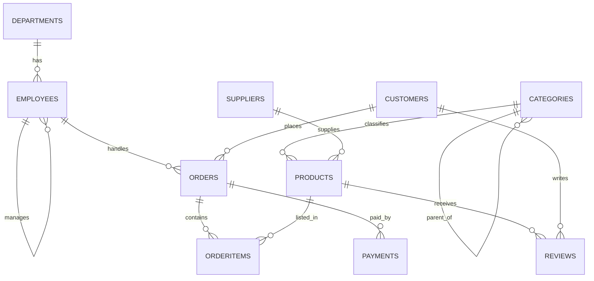

# TechShop — Schema Reference

A quick map of the practice database. Keep this open while you write queries.

## Entity relationships

## Tables & key columns

| Table | Primary key | Important columns | Foreign keys |
|---|---|---|---|
| `Departments` | DepartmentID | DepartmentName | — |
| `Employees` | EmployeeID | FirstName, LastName, Title, HireDate, Salary | ManagerID→Employees, DepartmentID→Departments |
| `Categories` | CategoryID | CategoryName | ParentCategoryID→Categories (tree) |
| `Suppliers` | SupplierID | SupplierName, City, Country | — |
| `Products` | ProductID | ProductName, UnitPrice, UnitsInStock, Discontinued | CategoryID→Categories, SupplierID→Suppliers |
| `Customers` | CustomerID | FirstName, LastName, Email (unique), City, Country | — |
| `Orders` | OrderID | OrderDate, Status, ShipCity, ShipCountry | CustomerID→Customers, EmployeeID→Employees |
| `OrderItems` | OrderItemID | Quantity, UnitPrice, Discount | OrderID→Orders, ProductID→Products |
| `Payments` | PaymentID | Amount, PaymentMethod, PaidAt | OrderID→Orders |
| `Reviews` | ReviewID | Rating (1–5), Comment | ProductID→Products, CustomerID→Customers |

## Useful facts
- `Orders.Status` ∈ {Pending, Paid, Shipped, Delivered, Cancelled}.
- `OrderItems.UnitPrice` is the price **captured at sale time** (may differ from `Products.UnitPrice` today).
- `OrderItems.Discount` is a fraction 0–1 (e.g., 0.10 = 10% off).
- Line revenue = `Quantity * UnitPrice * (1 - Discount)`.
- Two products are `Discontinued = 1` (IDs 39 & 40) — handy for filtered-index practice.
- `Categories` is a self-referencing tree (great for recursive CTEs in Module 6).
- `Employees.ManagerID` is a self-reference (org hierarchy).
